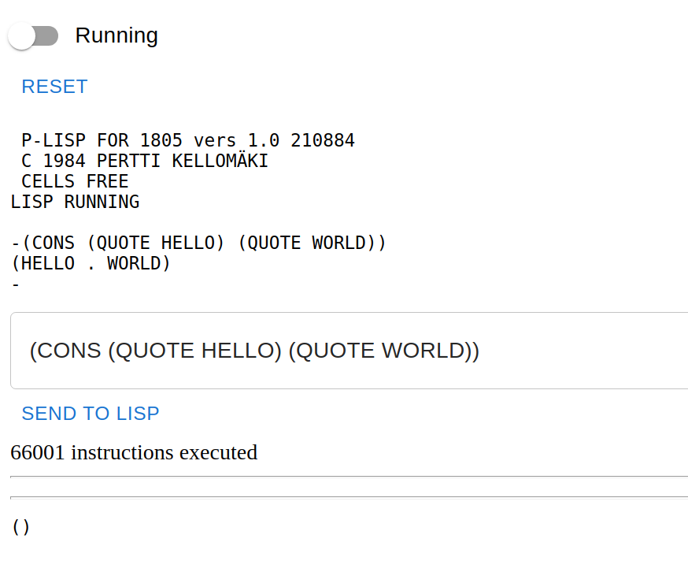

# plisp

Lisp in Lisp with a twist.

## Background

In the spring of 2020 I was between jobs, and about to start at Solita
in a Clojure project. I have a long and loving relationship with Lisp
and Scheme, but I had not written a single line of Clojure. Since I
had a bit of time in my hands, I thought it would be prudent to at
least try it out before starting on the job.  Instead of doing
something completely useless, it occurred to me that I could give an
old Lisp a new lease of life.

Back in 1983 I read an article in the Finnish computer magazine
Tietokone. The author Timo Noko described a Lisp implementation called
NokoLisp, which he had written for the Z-80 processor. I was
immediately mesmerized, and wanted to get one as well.

I had a home computer based on the RCA 1800 series, similar to the
[Cosmac ELF](https://en.wikipedia.org/wiki/COSMAC_ELF). The article
described NokoLisp in sufficient detail that I could start working on
my own implementation, and eventually I had cooked up a working Lisp
which I decided to call *plisp*.

As I remember, the implementation had some problems, and it was a bit
of a mess at places, so I decided to call it version 0.9, and do a
complete rewrite. I seem to have lost the original Lisp sources, but I
still have version 1.0 written down with a pencil in a number of small
notebooks.

## This repository

This repository contains an emulator for the RCA 1805 processor,
written in ClojureScript. I have cut some corners, mostly in the
handling of I/O, but for the purposes of running plisp it is a pretty
faithful representation of the processor architecture. The main
difference to the real thing is that my emulator executes assembler,
not binary instructions. It would not be very difficult to go all the
way to binary, but a bit pointless since I did not use self modifying
code or similar machine code tricks.

In addition to the processor, I have typed in most of the source of
plisp. It is still work in progress, but it can already evaluate
fairly complex Lisp expressions. The test set shows examples of those.

There is also an embryonic re-frame user interface for running plisp
in a browser window.

## License

Copyright © 2022 Pertti Kellomäki

This program and the accompanying materials are made available under the
terms of the Eclipse Public License 2.0 which is available at
http://www.eclipse.org/legal/epl-2.0.

This Source Code may also be made available under the following Secondary
Licenses when the conditions for such availability set forth in the Eclipse
Public License, v. 2.0 are satisfied: GNU General Public License as published by
the Free Software Foundation, either version 2 of the License, or (at your
option) any later version, with the GNU Classpath Exception which is available
at https://www.gnu.org/software/classpath/license.html.
